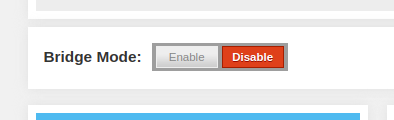

# Xfinity Router/Modem Combo

I am currently using my parent's old router/modem combo that they bought from
xfinity as only a modem. Here are the steps I took to set it up and the steps
you need in order to switch back to using the both the router and modem features
of the box.

## Use as a Modem

Toggle bridge mode.



Now restart the router.

## Use as Both a Router and Modem

To switch back to a router/modem setup you need to do some weird networking
tricks to access the modem's control panel so you can switch it back.

Create a new network config.
```sh
nmcli connection add \
  con-name 'Static xfinity Gateway Management' \
  type 'ethernet'
```

Change to `manual`.
```sh
nmcli connection modify 'Static xfinity Gateway Management' ipv4.method auto
```

Configure networking.
```sh
nmcli connection modify \
  'Static xfinity Gateway Management' \
  ipv4.gateway <router ip>
nmcli connection modify \
  'Static xfinity Gateway Management' \
  ipv4.addresses '10.0.0.8/24' # use whatever ip you want
```

Now you need to connect to the modem using a wired connection and open a web
browser to navigate to the router ip address. This router ip address should be
the same router ip used when you created the NetworkManager config and should be
the same ip that is used when router/modem is in router mode. Once you are in,
you can toggle bridge mode and restart the router.

